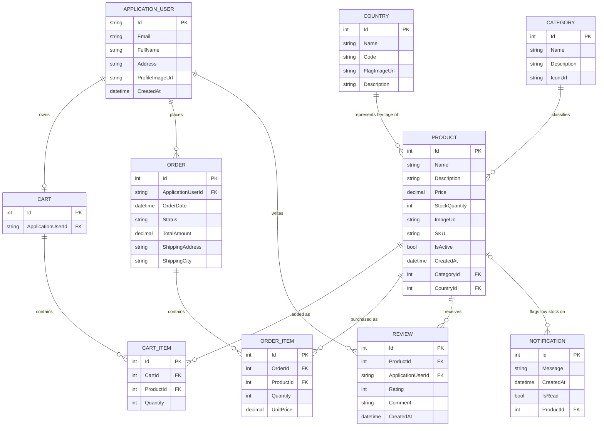
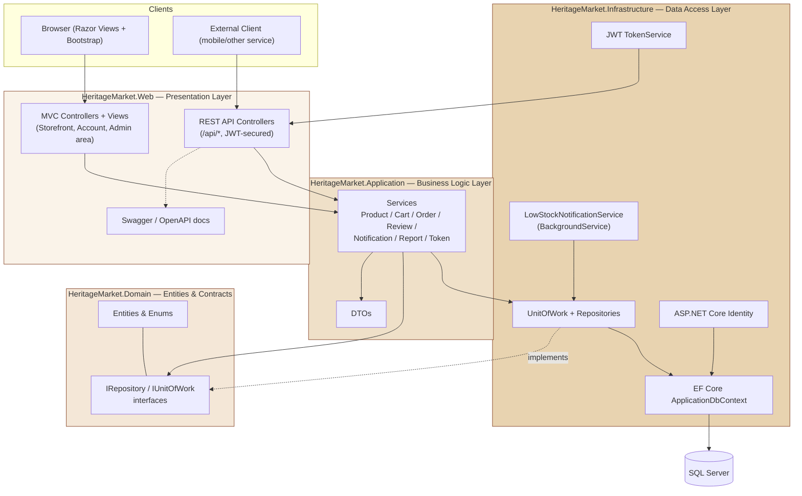
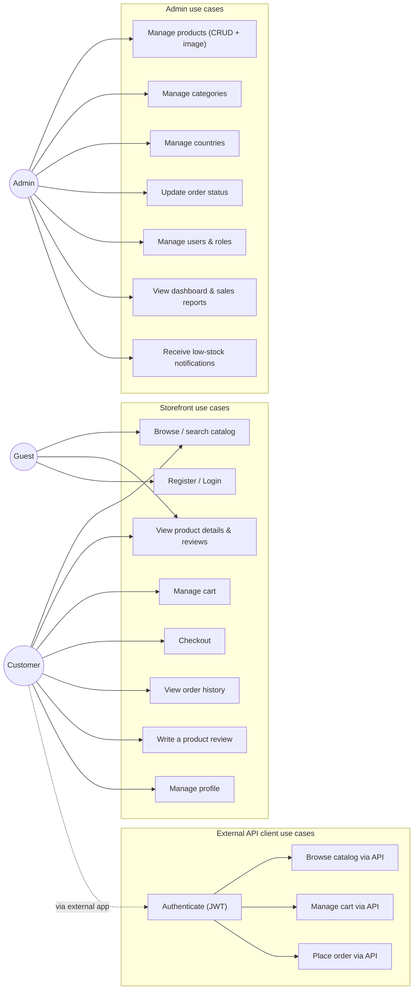

# Diagrams — Heritage Marketplace

These render natively on GitHub/GitLab/Azure DevOps (Mermaid support) and in most Markdown
previewers, including VS Code with the Markdown Preview Mermaid Support extension.

## 1. Entity-Relationship Diagram

## 2. System Architecture Diagram

## 3. Use Case Diagram

Mermaid has no native UML use-case shape, so actors and use cases are modeled as a flowchart —
actor nodes on the left, use cases grouped by area on the right.

